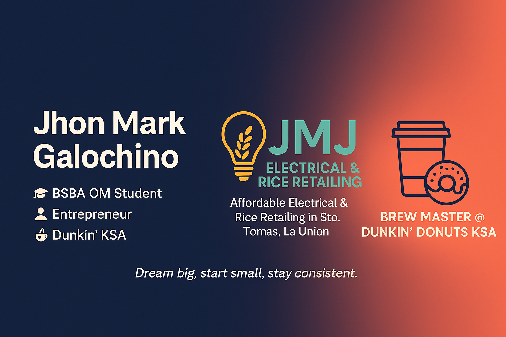

<p align="center">
  
</p>

<h2 align="center">
  👋 Welcome to My GitHub Portfolio
</h2>

<h1 align="center">
  Jhon Mark L. Galochino
</h1>

<h3 align="center">
  Bachelor of Science in Business Administration<br>
  Major in Operations Management • Graduate
</h3>

<p align="center">
  Retail Operations • Inventory Management • Business Technology • SmartPOS Project Creator
</p>

<p align="center">
  
</p>

<p align="center">
  <a href="https://jmjs-business-system.web.app">
    
  </a>

  <a href="https://sites.google.com/view/jhon-mark-galochino">
    
  </a>

  <a href="mailto:jhonmarkgalex68@gmail.com">
    
  </a>

  <a href="https://github.com/JMGalochino">
    
  </a>

  <a href="YOUR_LINKEDIN_PROFILE_URL">
    
  </a>
</p>

---

## 👨‍💼 About Me

I am an operations-focused professional with hands-on experience in **retail operations, inventory management, customer service, purchasing, cashier operations, food service, and business administration**.

Alongside my professional career, I manage our family-owned business, **JMJ Electrical Supply & Rice Retailing**, in La Union, Philippines. I focus on inventory control, supplier coordination, sales monitoring, customer service, and continuous improvement of daily retail operations.

To address real operational challenges, I created **JMJ's SmartPOS System**, a cloud-based Point-of-Sale and Inventory Management platform designed for practical retail use. The system supports sales processing, inventory monitoring, accounts receivable, business reporting, receipt printing, employee access, and offline operations.

I enjoy combining business knowledge and technology to create practical solutions that improve efficiency, accuracy, visibility, and decision-making.

---

## 🏆 Professional Highlights

| | |
|:--|:--|
| 🎓 **BSBA Operations Management Graduate** | 🏪 **Business Owner & Operations Manager** |
| 💻 **Creator of JMJ's SmartPOS System** | 📦 **Inventory Management Specialist** |
| 🛒 **Retail Operations Professional** | 🌍 **International Work Experience** |
| 📈 **Business Process Improvement** | ⚙️ **Business Technology Enthusiast** |

---

## 🎯 Professional Focus

| | |
|:--|:--|
| 📦 Inventory Management | ☁️ Cloud-Based Business Systems |
| 🏪 Retail Operations | 📱 Retail Digital Transformation |
| 💰 Point-of-Sale Systems | 📊 Business Reporting |
| 📈 Business Process Improvement | ⚡ Operations Efficiency |

---

## 💼 Professional Experience

<table>
<tr>
<td width="50%" valign="top">

<div align="center">

### 🇸🇦 Shahia Food Limited Company

#### Brew Master / Salesman

📍 Saudi Arabia

📅 **September 24, 2016 – September 24, 2026**

</div>

---

#### Key Responsibilities

- ☕ Prepared beverages according to company quality standards
- 💰 Operated POS systems and handled cashier transactions
- 📦 Monitored inventory and replenished stocks
- 👥 Delivered efficient and professional customer service
- 📊 Prepared daily sales and operational reports
- 🧹 Maintained food safety, hygiene, and store standards
- 🏪 Supported opening, closing, and shift operations

#### Skills Developed

`Customer Service`
`Retail Operations`
`POS Systems`
`Inventory`
`Sales`
`Cash Handling`
`Food Safety`

</td>

<td width="50%" valign="top">

<div align="center">

### 🇵🇭 JMJ Electrical Supply & Rice Retailing

#### Business Owner / Operations Manager

📍 La Union, Philippines

📅 **2021 – Present**

</div>

---

#### Key Responsibilities

- 🏪 Oversees daily retail and business operations
- 📦 Manages inventory planning and stock monitoring
- 🚚 Coordinates purchasing and supplier transactions
- 📈 Tracks sales and prepares business reports
- 💵 Maintains financial and operational records
- 👥 Supports customer service and delivery operations
- ⚙️ Plans and implements business process improvements
- 💻 Uses digital systems to improve inventory and recordkeeping

#### Skills Developed

`Operations Management`
`Inventory Management`
`Purchasing`
`Business Planning`
`Supplier Coordination`
`Leadership`
`Retail Operations`

</td>
</tr>

<tr>
<td width="50%" valign="top">

<div align="center">

### 🇵🇭 Vjandep Ventures Inc.

#### Salesperson

📍 Philippines

📅 **January 22, 2011 – September 26, 2013**

</div>

---

#### Key Responsibilities

- 🛍 Assisted customers with product inquiries and purchases
- 💰 Processed sales transactions and handled payments
- 📦 Supported inventory monitoring and stock availability
- 🏪 Maintained organized and attractive product displays
- 👥 Provided professional customer service
- 📋 Supported daily store operations

#### Skills Developed

`Retail Sales`
`Customer Service`
`Cashiering`
`Merchandising`
`Inventory Support`

</td>

<td width="50%" valign="top">

<div align="center">

### 🇵🇭 Peking House Restaurant

#### Kitchen Crew / Purchaser

📍 Philippines

📅 **November 5, 2013 – August 29, 2016**

</div>

---

#### Key Responsibilities

- 🍳 Assisted with food preparation and kitchen operations
- 🛒 Purchased ingredients and operational supplies
- 📦 Monitored inventory levels and stock availability
- 🚚 Coordinated purchasing and receiving requirements
- 🧹 Maintained food safety and workplace cleanliness
- 📋 Organized stock and inventory records

#### Skills Developed

`Purchasing`
`Inventory Management`
`Kitchen Operations`
`Food Safety`
`Supplier Coordination`

</td>
</tr>
</table>

---

## 🛤️ Professional Journey

```text
2011
│
├── 🛍️ Salesperson
│   └── Vjandep Ventures Inc.
│
2013
│
├── 🍳 Kitchen Crew / Purchaser
│   └── Peking House Restaurant
│
2016
│
├── ☕ Brew Master / Salesman
│   └── Shahia Food Limited Company
│       Dunkin' Donuts Saudi Arabia
│
2021
│
├── 🏪 Business Owner / Operations Manager
│   └── JMJ Electrical Supply & Rice Retailing
│
2025
│
└── 💻 JMJ's SmartPOS System
    └── Planning, testing, implementation,
        and continuous improvement
```

---

## 🎓 Education

<div align="center">

### University of Baguio

**Bachelor of Science in Business Administration**

**Major in Operations Management**

🎓 **Graduate**

📍 Baguio City, Philippines

</div>

---

## 📚 Continuous Learning

| | |
|:--|:--|
| 📦 Inventory Management | 📈 Business Analytics |
| 🏪 Retail Operations | 📊 Business Reporting |
| 💰 Business Administration | 💻 Business Technology |
| ☁️ Cloud-Based Systems | ⚙️ Process Improvement |
| 🚀 Retail Digitalization | 🧠 Continuous Professional Development |

---

## 🚀 Featured Project

<div align="center">

# 🛒 JMJ's SmartPOS System

### Cloud-Based Point-of-Sale & Inventory Management Platform

A practical retail management system designed around real business operations.

<p>
  <a href="https://jmjs-business-system.web.app">
    
  </a>
</p>

</div>

---

## 📖 Project Overview

**JMJ's SmartPOS System** is a cloud-based Point-of-Sale and Inventory Management platform created to support the daily operations of **JMJ Electrical Supply & Rice Retailing**.

The system was planned around actual retail workflows rather than sample or classroom scenarios. It brings sales, inventory, purchasing, customer accounts, receipts, employee access, reporting, and offline operations into one connected platform.

The project continues to evolve based on real operational requirements, testing, and business experience.

---

## 🎯 Business Objectives

| | |
|:--|:--|
| 📦 Improve inventory accuracy | 💰 Simplify cashier operations |
| 📝 Reduce manual recordkeeping | 📴 Support offline transactions |
| 📊 Generate useful business reports | 👥 Improve customer account management |
| 🧾 Automate receipt printing | ⚡ Improve operational efficiency |
| 🔍 Strengthen transaction visibility | ☁️ Keep data available across devices |

---

## 👨‍💼 My Role in the Project

I lead the business and operational side of the project, including:

- 📋 Business requirements planning
- 🏪 Retail workflow design
- 📦 Inventory process design
- 💳 POS and payment workflow planning
- 🎨 User interface and usability review
- 🧪 Feature testing and quality assurance
- 🛠️ Implementation and system configuration
- 📈 Continuous feature improvement
- 🤖 AI-assisted development workflows
- 📝 Business documentation and process review

The project is developed using modern tools while I define the business rules, test the workflows, review the output, and guide its continuous improvement.

---

## 📊 Business Impact

| | |
|:--|:--|
| ✅ Supports real retail operations | ✅ Centralizes business records |
| ✅ Improves stock visibility | ✅ Reduces repetitive manual work |
| ✅ Speeds up cashier workflows | ✅ Improves sales monitoring |
| ✅ Supports barcode-based selling | ✅ Produces consistent receipts |
| ✅ Enables offline business continuity | ✅ Improves accountability through roles |
| ✅ Supports customer receivables | ✅ Provides clearer operational reports |

---

## ✨ Core Capabilities

<table>
<tr>
<td width="50%" valign="top">

### 🛒 Sales & Checkout

- Point-of-Sale transactions
- Barcode and QR scanning
- Cash and non-cash payments
- Mixed payment support
- Discounts and overrides
- Sales returns
- Void processing
- Cash drawer integration
- Receipt printing

</td>

<td width="50%" valign="top">

### 📦 Inventory & Purchasing

- Product and category management
- Stock monitoring
- Purchasing and receiving
- Supplier management
- Stock movements
- Product transfers
- Supplier returns
- Stocktake and reconciliation
- Product label printing

</td>
</tr>

<tr>
<td width="50%" valign="top">

### 💳 Accounts & Finance

- Accounts receivable
- Customer balances
- Credit terms
- Payment tracking
- Expense monitoring
- Cash flow records
- Sales and financial summaries
- Business reporting

</td>

<td width="50%" valign="top">

### ⚙️ Operations & Control

- Shift management
- Starting cash records
- X and Z readings
- Cash drawer monitoring
- User roles and permissions
- Activity logs
- Archives and backups
- Offline mode with synchronization
- System health monitoring

</td>
</tr>
</table>

---

## 🧩 Complete System Modules

| Module | Purpose |
|:--|:--|
| 🏠 **Dashboard** | Displays operational summaries, alerts, and key business information |
| 🛒 **Quick Sale / POS** | Handles cashier transactions, payments, discounts, returns, and receipts |
| 📦 **Inventory** | Manages products, categories, units, prices, stock levels, and labels |
| 🚚 **Purchases & Receiving** | Records supplier purchases and stock receiving |
| 🔄 **Stock Movements** | Tracks inventory increases, decreases, transfers, and corrections |
| ↩️ **Returns & Damages** | Records customer returns, damaged products, and stock adjustments |
| 🔁 **Transfer In / Out** | Supports controlled movement of stocks between locations or records |
| 📤 **Supplier Returns** | Tracks products returned to suppliers |
| 🧮 **Stocktake & Reconciliation** | Compares physical stocks with system quantities |
| 📈 **Sales Center** | Consolidates sales, returns, transaction history, and exports |
| 💳 **Accounts Receivable** | Manages credit sales, customer balances, due dates, and payments |
| 💸 **Expenses** | Records and categorizes operating expenses |
| 🧾 **Receipts** | Manages sales, returns, voids, payments, and receipt reprinting |
| 🕒 **Shift Control** | Handles starting cash, tender declarations, X readings, and Z readings |
| 💵 **Cash Drawer** | Controls cash drawer access and cash-related transactions |
| 📊 **Cash Flow** | Tracks business cash inflows and outflows |
| 👥 **Customers** | Maintains customer information and transaction relationships |
| 🚛 **Suppliers** | Manages supplier records and purchasing relationships |
| 📋 **Reports** | Produces sales, inventory, financial, shift, and operational reports |
| 👤 **Users & Roles** | Controls owner, manager, cashier, and viewer permissions |
| 🗂️ **Archives** | Stores archived business records |
| 📝 **Logs** | Maintains operational and user activity records |
| ⚙️ **Settings** | Controls business information, printing, taxes, and system preferences |
| ☁️ **Offline Engine** | Keeps core operations available during internet interruptions |
| 🩺 **System Health** | Displays connection, synchronization, and service status |

---

## 🏗️ System Workflow

```text
Business Operations
        │
        ▼
┌───────────────────────────────┐
│       JMJ's SmartPOS          │
├───────────────────────────────┤
│ Point of Sale                 │
│ Inventory Management          │
│ Purchasing & Suppliers        │
│ Accounts Receivable           │
│ Expenses & Cash Flow          │
│ Shift & Cash Drawer Control   │
│ Reports & Business Records    │
└───────────────────────────────┘
        │
        ├──► Offline Storage
        │
        ├──► Cloud Synchronization
        │
        ├──► Thermal Printer
        │
        ├──► Barcode / QR Scanner
        │
        └──► Cash Drawer
```

---

## 🖥️ System Preview

<p align="center">
  
</p>

> Save your main SmartPOS screenshot in the repository using the filename **`SmartPOS.png`** so it displays correctly here.

---

## 📸 Planned System Gallery

Additional screenshots can be added later using these filenames:

| Dashboard | Point of Sale |
|:--:|:--:|
| `Dashboard.png` | `POS.png` |

| Inventory | Accounts Receivable |
|:--:|:--:|
| `Inventory.png` | `Receivables.png` |

| Reports | Shift Control |
|:--:|:--:|
| `Reports.png` | `ShiftControl.png` |

| Receipt Preview | Settings |
|:--:|:--:|
| `Receipt.png` | `Settings.png` |

Kapag ready na ang screenshots, palitan natin itong filename guide ng actual image gallery.

---

## 🛠️ Technology Stack

<div align="center">


</div>

### Development Technologies

| Technology | Use in the Project |
|:--|:--|
| ⚛️ **React** | User interface and reusable system components |
| ⚡ **Vite** | Fast development and production build system |
| 🔥 **Firebase** | Authentication, cloud database, and hosting |
| 🎨 **Tailwind CSS** | Responsive interface styling |
| 🟨 **JavaScript** | Application logic and system workflows |
| 🌐 **HTML & CSS** | Structure, printing, and interface presentation |
| 📱 **Progressive Web App** | Installable browser-based application |
| 🗃️ **IndexedDB** | Offline storage and local transaction continuity |
| 🔧 **Git & GitHub** | Version control and project management |
| 🖨️ **Printer Bridge** | Thermal printing and cash drawer integration |

### Business & Productivity Tools

- Microsoft Excel
- Microsoft PowerPoint
- Google Sheets
- Google Workspace
- Canva
- Barcode and QR systems
- Thermal receipt printers
- Cash drawer hardware
- AI-assisted development tools

---

## 🔐 Access & Data Protection

The public website currently opens the secure login interface.

- Business information is protected behind authentication
- Operational modules require authorized user access
- User permissions are controlled by role
- Sensitive business records are not publicly exposed
- Public visitors cannot access actual company transactions

---

## 🌐 Live System

<div align="center">

### [Open JMJ's SmartPOS System](https://jmjs-business-system.web.app)

**Public preview:** Login interface  
**Protected access:** Business data and operational modules

</div>

---

# 🎯 Current Focus

I am currently focused on developing practical business solutions that improve retail operations through technology.

- 🚀 Continuously improving **JMJ's SmartPOS System**
- 📦 Enhancing inventory and warehouse management
- ☁️ Expanding cloud-based retail solutions
- 📊 Improving business reporting and analytics
- 🤖 Exploring AI-assisted business workflows
- 🌍 Building a professional portfolio for international opportunities

---

# 🌐 Portfolio

Explore my projects and professional portfolio.

<div align="center">

| Resource | Link |
|:--|:--|
| 🌐 Portfolio Website | https://sites.google.com/view/jhon-mark-galochino |
| 💻 JMJ's SmartPOS | https://jmjs-business-system.web.app |
| 💼 LinkedIn | https://www.linkedin.com/in/jhon-mark-galochino-5b318340a |
| 📧 Email | jhonmarkgalex68@gmail.com |

</div>

---

# 📬 Let's Connect

<p align="center">

<a href="mailto:jhonmarkgalex68@gmail.com">📧 Email</a> •
<a href="https://www.linkedin.com/in/jhon-mark-galochino-5b318340a">💼 LinkedIn</a> •
<a href="https://sites.google.com/view/jhon-mark-galochino">🌐 Portfolio</a> •
<a href="https://jmjs-business-system.web.app">🚀 SmartPOS</a>

</p>

---

<p align="center">

### Thank you for visiting my GitHub Portfolio!

**Building practical business solutions through operations, technology, and continuous improvement.**

⭐ Feel free to connect, explore my projects, and follow my journey.

</p>
